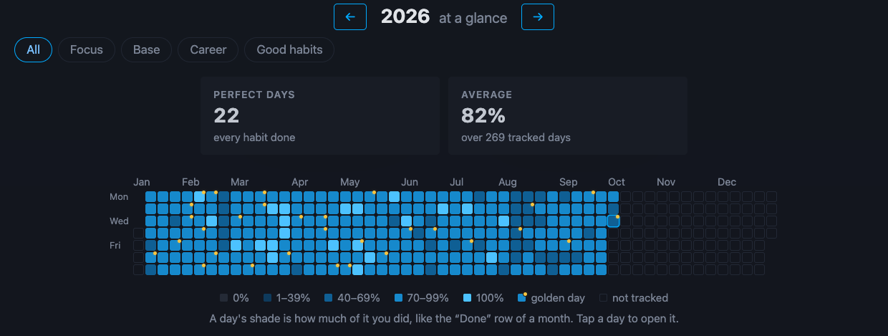
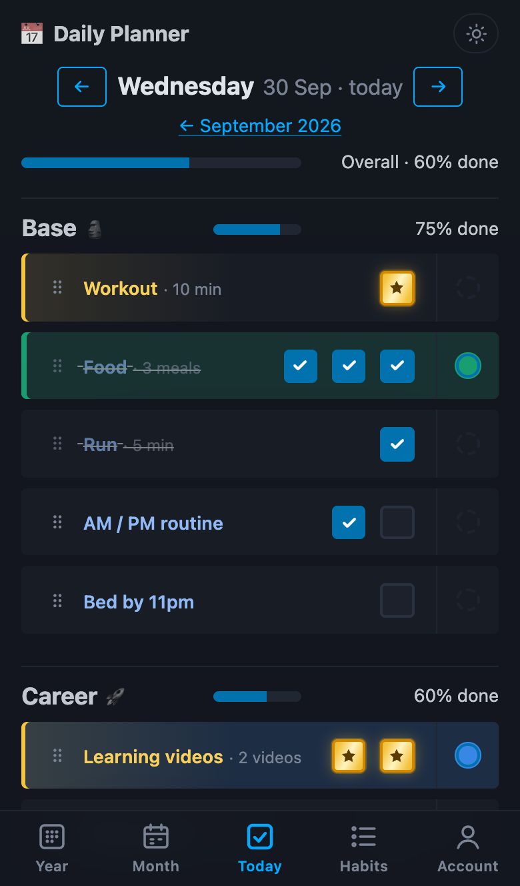
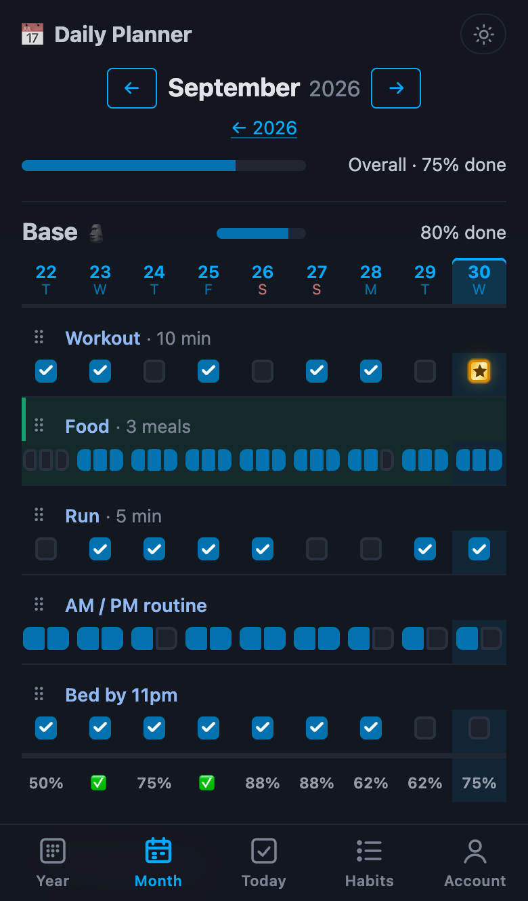
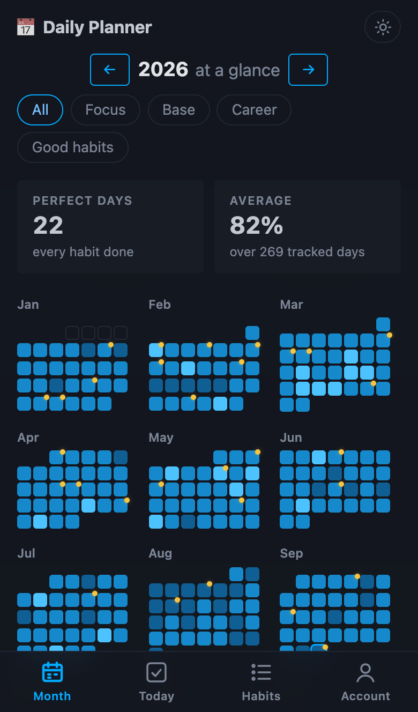
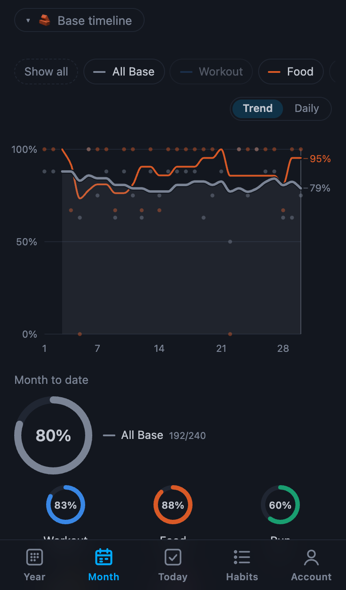

# Daily Planner

[](https://github.com/iraynovskyy/daily-planner/actions/workflows/ci.yml)


A daily habit tracker: tick off habits each day, see the whole month as a grid and the whole year
at a glance, and follow your progress on per-category timelines. Server-rendered with FastAPI + Jinja2, made interactive with
HTMX — no frontend build step.


**The whole year** on one page: every day is a square shaded by how much of it you did, a gold
dot marks a golden day, and two quiet facts sit on top (perfect days and the average).

<picture>
  <source media="(prefers-color-scheme: light)" srcset="docs/screenshots/year-light.png">
  
</picture>

**On a phone** the header links become a bottom tab bar, each habit's name sits above its checks
so about nine days fit on screen, and charts start with the overall line (tap a habit to add its
own). Add it to the home screen and it opens full screen on today's checklist, like an app.

| Today | Month | Year | Timeline & rings |
|:---:|:---:|:---:|:---:|
|  |  |  |  |

## Features
- **Categories** (e.g. Base, Career, Good habits), each with its own progress bar, month grid and timeline
- **Multi-check habits** ("3 meals", "2 videos") and **optional** habits that are tracked but don't count towards progress
- **Month grid**: every day at a glance; click any cell to tick it
- **Golden days**: double-tap a habit's box when you did it especially well, and it turns into a gold star
- **Streaks**: a 🔥 badge once a habit is done 5+ days in a row
- **Year at a glance**: a square per day shaded by completion, perfect days, the average and the most consistent habits, per category or for a hand-picked **Focus** set of habits
- **Timelines** with progress rings per category: smooth 7-day-average trend lines with each day as a faint dot (or a Daily view with the exact values), a line per habit to show or hide (or all at once); today counts once you tick something, so an unfinished day never shows as a drop to 0%
- **Drag-and-drop** (or keyboard) reordering and per-row highlight colours
- **Notes** in collapsible blocks (tips, ideas, comfort), editable in place and movable between blocks
- **Light / dark theme** switch, remembered per browser
- **Phone layout**: bottom tab bar, compact month grid, touch-friendly charts; **installable** on the home screen, with Today and Year shortcuts on the icon
- **Several users**, each with their own data; invite a friend with a one-time link

## Tech stack
| Layer | Choice |
|---|---|
| Web | FastAPI, Jinja2 templates, HTMX, Pico CSS |
| Data | SQLModel (SQLAlchemy) on PostgreSQL (psycopg 3); SQLite for quick local runs |
| Migrations | Alembic |
| Ops | Docker (multi-stage, non-root), Docker Compose, `/health` check |
| Tooling | uv, Ruff, pytest, pre-commit, GitHub Actions, Dependabot |

## Run locally
Requires [uv](https://docs.astral.sh/uv/).
```bash
uv sync                                   # install dependencies
cp .env.example .env                      # optional, defaults work
uv run alembic upgrade head               # create / upgrade the database schema
uv run uvicorn app.main:app --reload      # http://localhost:8000
```
Data lives in `data/planner.db`, so it survives restarts.

Everything is behind a login. Create your user once (the password is asked, not typed as an
argument, so it stays out of shell history), then log in at `/login`:
```bash
uv run python -m app.create_user <username>           # --reset to change the password
docker compose exec app python -m app.create_user <username>   # same, inside Docker
```

Every user has their own categories, habits, checks and notes. A user created with the command
above starts from [`seed.example.toml`](seed.example.toml); to start with your own habits and
notes, copy it to `seed.local.toml` (git-ignored) and edit it, or point `SEED_FILE` at another file.

To let a friend in, open **Account → Create invite link** and send them the link: they pick their
own username and password and start from the example set. Each link works once and expires after
7 days.

## Run with Docker (app + PostgreSQL)
The same setup that runs in production:
```bash
cp .env.example .env                      # then set POSTGRES_PASSWORD to a long random value
docker compose up -d --build              # http://localhost:8000, health: /health
docker compose logs -f app
docker compose down                       # stop (data stays in the pgdata volume)
```
The container applies pending migrations on start, runs as a non-root user and reports its health
through `/health`. Postgres is reachable from the host on `127.0.0.1:5433`.

To move existing data from SQLite into Postgres (ids are kept, sequences are fixed up):
```bash
docker compose stop app
uv run python -m app.copy_data sqlite:///data/planner.db \
  postgresql+psycopg://planner:<POSTGRES_PASSWORD>@127.0.0.1:5433/planner --replace
docker compose start app
```

## Deployment
Every push to `main` goes through the same pipeline ([`.github/workflows/ci.yml`](.github/workflows/ci.yml)):

```
tests (SQLite + Postgres) → build image once → push to GHCR (ghcr.io/…:sha-<commit>) → deploy
```
The deploy job SSHes into the server with a key that can only run [`deploy/deploy.sh`](deploy/deploy.sh)
(a forced command; the host key is pinned). The script takes a backup, pulls the tested image,
restarts the app, waits for `/health`, and rolls back to the previous image if it doesn't come up.

The server runs Nginx (HTTPS via Let's Encrypt, HTTP/2, HSTS) in front of the Compose stack; app
and database ports are bound to localhost only.

## Backups
Nightly at 03:30 a systemd timer runs [`deploy/backup/backup.sh`](deploy/backup/backup.sh):
1. `pg_dump` of the database, checked with `pg_restore --list`, kept on the server for 14 days;
2. an encrypted, deduplicated off-site copy with **restic** in Cloudflare R2 (S3 API):
   30 daily, 12 weekly and 24 monthly snapshots, then `restic check`.

```bash
sudo deploy/backup/setup-r2.sh            # once: R2 credentials + restic password (interactive)
sudo systemctl start daily-planner-backup # run a backup now
sudo deploy/backup/verify-restore.sh      # restore the latest off-site copy into a scratch DB and compare
sudo deploy/backup/restore.sh latest      # disaster recovery: replace the live DB (asks to confirm)
```

## Security
| Concern | How it's handled |
|---|---|
| Passwords | argon2id hashes with a random salt each (`argon2-cffi`); plain passwords are never stored |
| Sessions | signed cookie (`SECRET_KEY`), `HttpOnly`, `SameSite=Lax`, `Secure` with `SESSION_HTTPS_ONLY=true`; renewed on login |
| Access | every planner router requires a login; only `/login`, `/join/…`, `/health`, `/manifest.webmanifest` and `/static` are public |
| Data isolation | categories, habits and notes carry a `user_id`; every query and every lookup by id is scoped to the logged-in user, so another user's ids act as if they don't exist (404) |
| Invites | one-time, random 192-bit tokens that expire after 7 days; only their SHA-256 is stored |
| CSRF | `SameSite=Lax` + rejecting POSTs whose `Sec-Fetch-Site` / `Origin` show another site — covers forms, HTMX and `fetch()` without per-form tokens |
| Brute force | 5 failed logins per 15 min per IP and per username, then HTTP 429 |
| User enumeration | same message and same work (a dummy hash check) for unknown users and wrong passwords |
| Open redirects | `?next=` accepts only local paths (no `//host`, backslashes, control characters) |

## Develop
```bash
uv run pre-commit install                 # once: lint + format on every commit
uv run pytest
uv run ruff check . && uv run ruff format .
# after changing app/models.py:
uv run alembic revision --autogenerate -m "describe change" && uv run alembic upgrade head
```
Run the tests against Postgres instead of in-memory SQLite:
```bash
TEST_DATABASE_URL=postgresql+psycopg://planner:<password>@127.0.0.1:5433/planner_test uv run pytest
```
CI runs lint and format checks, checks that migrations match the models, runs the tests on both
SQLite and PostgreSQL, and builds the Docker image — on every push and pull request.

## Project layout
```
app/
  main.py          app factory, static files, routers
  auth.py          password hashing, invites, login rate limiting, CSRF middleware
  create_user.py   CLI: create a user / reset a password
  copy_data.py     copy all rows between databases (SQLite → Postgres)
  models.py        Category, Habit (recurring template), DailyEntry (progress per habit per day), Note, User, Invite
  services.py      business logic, no web code
  routes/pages.py  full pages: / (month grid), /day/…, /year/…, /habits; /today and /year shortcuts
  routes/api.py    form / HTMX endpoints that return HTML fragments
  routes/auth.py   /login, /logout, /account (invite links), /join/… (sign up with an invite)
  routes/health.py /health: liveness + database check
  routes/pwa.py    /manifest.webmanifest: home-screen install, icon shortcuts
  templates/       Jinja HTML; partials/ are the fragments HTMX swaps in
  static/          CSS and small vanilla-JS modules (reorder, highlight, notes, timeline, rings, theme)
migrations/        Alembic schema history
seed.example.toml  starter categories, habits and notes for a new user
tests/             pytest: services, routes, auth / security, data copy
Dockerfile         multi-stage image built with uv
compose.yml        local stack: app + PostgreSQL
deploy/deploy.sh   server-side deploy: backup, pull image, health check, rollback
deploy/backup/     backup, restore and restore-check scripts + systemd timer
```

## Roadmap
- [x] PostgreSQL + Docker Compose
- [x] Login (hashed passwords, secure sessions, CSRF, rate limiting)
- [x] Deploy to a VPS behind Nginx with HTTPS, automated from GitHub Actions
- [x] Database backups: nightly pg_dump + restic to Cloudflare R2 (S3 API), restore check
- [x] Several users, each with their own data; friends join with a one-time invite link
- [ ] Health check, uptime monitoring and error tracking
- [ ] Public demo instance with sample data
