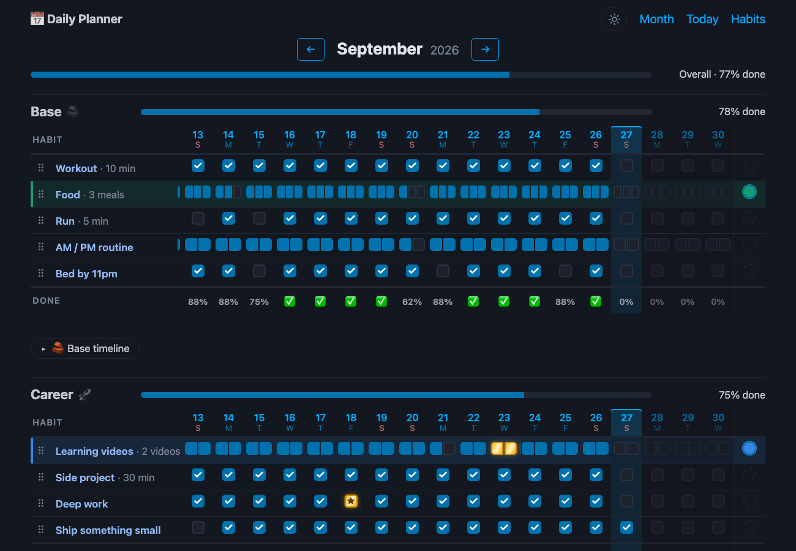
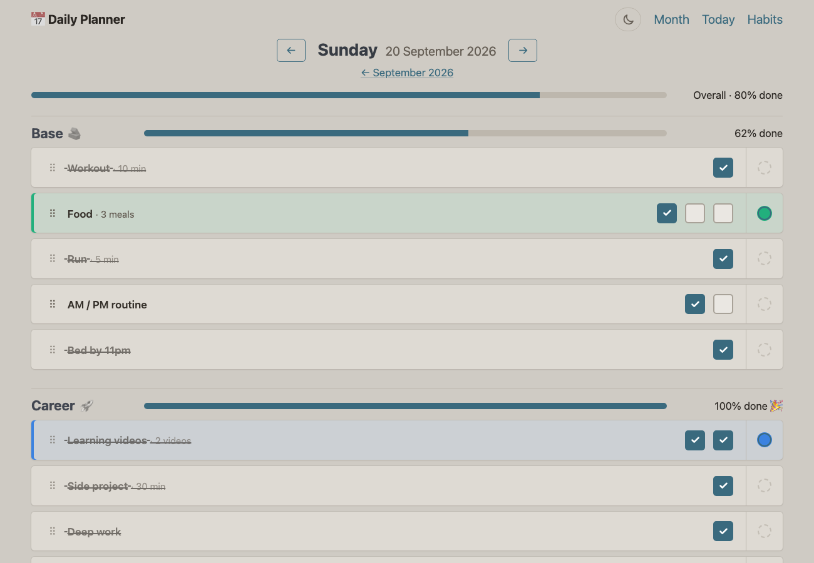
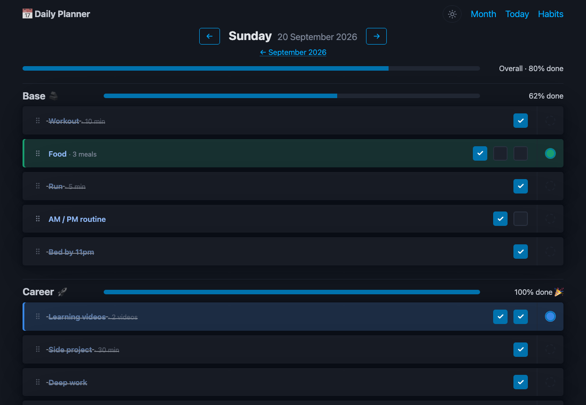

# Daily Planner

[](https://github.com/iraynovskyy/daily-planner/actions/workflows/ci.yml)


A daily habit tracker: tick off habits each day, see the whole month as a grid, and follow your
progress on per-category timelines. Server-rendered with FastAPI + Jinja2, made interactive with
HTMX — no frontend build step.



| Day checklist (light) | Day checklist (dark) |
|---|---|
|  |  |

## Features
- **Categories** (e.g. Base, Career, Good habits), each with its own progress bar, month grid and timeline
- **Multi-check habits** ("3 meals", "2 videos") and **optional** habits that are tracked but don't count towards progress
- **Month grid**: every day at a glance; click any cell to tick it
- **Timelines** with progress rings per category
- **Drag-and-drop** (or keyboard) reordering and per-row highlight colours
- **Notes** in collapsible blocks (tips, ideas, comfort), editable in place and movable between blocks
- **Light / dark theme** switch, remembered per browser

## Tech stack
| Layer | Choice |
|---|---|
| Web | FastAPI, Jinja2 templates, HTMX, Pico CSS |
| Data | SQLModel (SQLAlchemy) on PostgreSQL (psycopg 3); SQLite for quick local runs |
| Migrations | Alembic |
| Ops | Docker (multi-stage, non-root), Docker Compose, `/health` check |
| Tooling | uv, Ruff, pytest, pre-commit, GitHub Actions, Dependabot |

## Run locally
Requires [uv](https://docs.astral.sh/uv/).
```bash
uv sync                                   # install dependencies
cp .env.example .env                      # optional, defaults work
uv run alembic upgrade head               # create / upgrade the database schema
uv run uvicorn app.main:app --reload      # http://localhost:8000
```
Data lives in `data/planner.db`, so it survives restarts.

Everything is behind a login. Create your user once (the password is asked, not typed as an
argument, so it stays out of shell history), then log in at `/login`:
```bash
uv run python -m app.create_user <username>           # --reset to change the password
docker compose exec app python -m app.create_user <username>   # same, inside Docker
```

A fresh database is filled once from [`seed.example.toml`](seed.example.toml). To start with your
own habits and notes, copy it to `seed.local.toml` (git-ignored) and edit it, or point `SEED_FILE`
at another file.

## Run with Docker (app + PostgreSQL)
The same setup that runs in production:
```bash
cp .env.example .env                      # then set POSTGRES_PASSWORD to a long random value
docker compose up -d --build              # http://localhost:8000, health: /health
docker compose logs -f app
docker compose down                       # stop (data stays in the pgdata volume)
```
The container applies pending migrations on start, runs as a non-root user and reports its health
through `/health`. Postgres is reachable from the host on `127.0.0.1:5433`.

To move existing data from SQLite into Postgres (ids are kept, sequences are fixed up):
```bash
docker compose stop app
uv run python -m app.copy_data sqlite:///data/planner.db \
  postgresql+psycopg://planner:<POSTGRES_PASSWORD>@127.0.0.1:5433/planner --replace
docker compose start app
```

## Security
| Concern | How it's handled |
|---|---|
| Passwords | argon2id hashes with a random salt each (`argon2-cffi`); plain passwords are never stored |
| Sessions | signed cookie (`SECRET_KEY`), `HttpOnly`, `SameSite=Lax`, `Secure` with `SESSION_HTTPS_ONLY=true`; renewed on login |
| Access | every planner router requires a login; only `/login`, `/health` and `/static` are public |
| CSRF | `SameSite=Lax` + rejecting POSTs whose `Sec-Fetch-Site` / `Origin` show another site — covers forms, HTMX and `fetch()` without per-form tokens |
| Brute force | 5 failed logins per 15 min per IP and per username, then HTTP 429 |
| User enumeration | same message and same work (a dummy hash check) for unknown users and wrong passwords |
| Open redirects | `?next=` accepts only local paths (no `//host`, `\\`, control characters) |

## Develop
```bash
uv run pre-commit install                 # once: lint + format on every commit
uv run pytest
uv run ruff check . && uv run ruff format .
# after changing app/models.py:
uv run alembic revision --autogenerate -m "describe change" && uv run alembic upgrade head
```
Run the tests against Postgres instead of in-memory SQLite:
```bash
TEST_DATABASE_URL=postgresql+psycopg://planner:<password>@127.0.0.1:5433/planner_test uv run pytest
```
CI runs lint and format checks, checks that migrations match the models, runs the tests on both
SQLite and PostgreSQL, and builds the Docker image — on every push and pull request.

## Project layout
```
app/
  main.py          app factory, static files, routers
  auth.py          password hashing, login rate limiting, CSRF middleware
  create_user.py   CLI: create a user / reset a password
  copy_data.py     copy all rows between databases (SQLite → Postgres)
  models.py        Category, Habit (recurring template), DailyEntry (progress per habit per day), Note, User
  services.py      business logic, no web code
  routes/pages.py  full pages: / (month grid), /day/…, /habits
  routes/api.py    form / HTMX endpoints that return HTML fragments
  routes/auth.py   /login, /logout
  routes/health.py /health: liveness + database check
  templates/       Jinja HTML; partials/ are the fragments HTMX swaps in
  static/          CSS and small vanilla-JS modules (reorder, highlight, notes, timeline, rings, theme)
migrations/        Alembic schema history
seed.example.toml  default categories, habits and notes for a fresh database
tests/             pytest: services, routes, auth / security, data copy
Dockerfile         multi-stage image built with uv
compose.yml        local stack: app + PostgreSQL
```

## Roadmap
- [x] PostgreSQL + Docker Compose
- [x] Login (hashed passwords, secure sessions, CSRF, rate limiting)
- [ ] Deploy to a VPS behind Nginx with HTTPS, automated from GitHub Actions
- [ ] Database backups to S3
- [ ] Health check, uptime monitoring and error tracking
- [ ] Public demo instance with sample data
